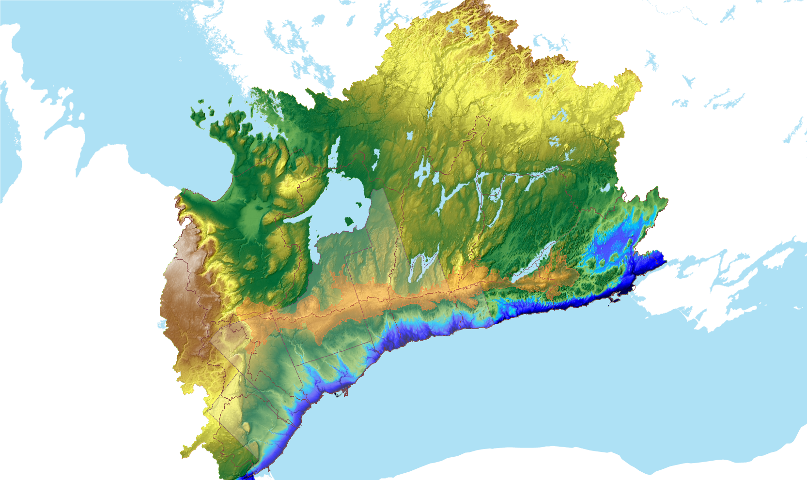

```{r setup, include=FALSE}
knitr::opts_chunk$set(echo = TRUE)
```

<br></br><br></br>
__*<mark>PLEASE NOTE THAT THE FOLLOWING PAGE IS IN DRAFT</mark>*__
<br></br><br></br>


# Map
Presented up front is the __*final*__ product for which the rest of this document describes. It is a map of the ORMGP jurisdiction discretized into ~10km² sub-watersheds. *Clicking* at any sub-watershed will return a number of properties. In the sample below, sub-watersheds are colour-coded according to their degree of impervious cover.
```{r, echo=FALSE, message=FALSE, warning=FALSE, out.height='600px', out.width='100%', fig.cap="ORMGP v.2020 10km² sub-watershed map"}
library(leaflet)
library(rgdal)
ormgp <- readOGR("shp/owrc20-50a_SWS10-final.geojson",verbose = FALSE)

leaflet(ormgp) %>%
  addProviderTiles( providers$Stamen.TonerLite, options = providerTileOptions(noWrap = TRUE) ) %>%
  addPolygons(color = ~colorQuantile("YlGnBu", ormgp$perimp)(perimp),
              popup = ~paste0('<b>subwatershed: ',mmID,'</b>',
                              '<br>             area: ',round(Area/1000000,1),'km²',
                              '<br>     permeability: ',perm,
                              '<br> impervious cover: ',round(perimp*100,0),'%',
                              '<br>     canopy cover: ',round(percov*100,0),'%',
                              '<br> open water cover: ',round(perow*100,0),'%',
                              '<br>    wetland cover: ',round(perwl*100,0),'%'
                              )
              )

```


# Introduction

The 3 million hectare ORMGP jurisdiction is subdivided to a number of 10km² sub-watersheds as a basis for hydrometeorological data analysis. Every sub-watershed has a defined topological order in which headwater sub-watersheds can easily be mapped to subseqential downstream sub-watersheds, and so on until feeding the great lakes. The intent here is to deem these sub-watersheds a "logical unit" for climatological and water budget analyses. Below is a description of the derivation the v.2020 OWRC 10km² sub-watershed map and its dervivatives including:

- a catchment area delinatation tool
- an interpolated realtime daily meterological dataset dating back to the year 1900
- an overlay analysis is performed for each sub-watershed used to characterize:
 - Impervious area
 - canopy coverage
 - waterbody coverage
 - wetland coverage
 - relative permeability/infiltrability of surficial geology
 - mean slope and dominant aspect
 - mean depth to watertable.

Below first describes the processing of a Provincial Digital Elevation Model (DEM) yielding a "hydrologically-correct" model of the ORMGP ground surface. From this information, the ORMGP region is poritionned into 2,813 ~10km² sub-watersheds. 


# Digital Elevation Model
Ground surface elevations were collected from the 2006 version of the Provincial (Ministry of Natural Resources) Digital Elevation Model (DEM). This is a 10x10m² DEM derived from 1:10,000 scale OBM base mapping based on photogrammetic elevation points and 5m contours where the photogrammetic elevation points did not exist. A 50x50m² Digital Elevation Model (DEM) is produced by merging the tiles shown below:

```{r fig.asp=0.50, fig.align="center", fig.width=12, message=FALSE, warning=FALSE, echo=FALSE, fig.cap="MNR 2006 Provincial DEM tiles shown in green."}
library(ggplot2)
library(geojsonio)
library(sf)

spGL <- geojson_read("shp/greatLakes.geojson",  what="sp")
spMNR <- geojson_read("shp/MNR_2006-tiles.geojson",  what="sp")
spORMGP <- geojson_read("shp/ORMGP-region.geojson",  what="sp")
spYPDTH <- geojson_read("shp/YPDTH.geojson",  what="sp")

spMNR_points <- as.data.frame(do.call(rbind, lapply(spMNR@polygons, function(x) x@labpt))) # Convert nested list to data frame by column
names(spMNR_points) <- c('long','lat') 
spMNR_points$num = spMNR$NUMBER

ggplot() +
    geom_polygon(data=spGL, aes(x=long, y=lat, group=group), fill="#51a8ff", color="#51a8ff") +
    geom_polygon(data=spYPDTH, aes(x=long, y=lat, group=group), fill=NA, color="brown", size=1) +
    geom_polygon(data=spORMGP, aes(x=long, y=lat, group=group), fill=NA, color="orange4", size=1) +
    geom_polygon(data=spMNR, aes(x=long, y=lat, group=group), fill=NA, color="darkgreen",size=1) +
    
    geom_text(data=spMNR_points, aes(x=long, y=lat, label=num), color="darkgreen") +
    
    theme_bw() + theme(axis.title = element_blank(), 
                       title = element_blank(), 
                       legend.box.spacing = unit(0, "mm")) +
                       # plot.background=element_rect(fill="red")) +
    #labs(x='longitude',y='latitude', title="MNR 2006 Provincial DEM tiles shown in green.") +
    coord_sf(xlim=c(-81, -77), ylim=c(43, 45.75), expand=FALSE)

```

Elevation data were up-scaled by taking the average of known elevations occurring within every 50x50m² cell. The resulting grid is a 5000x5000 50m-uniform cell grid, with an upper-left-corner origin at (E: 545,000, N: 5,035,000) NAD83 UTM zone 17.


## Hydrological "correction" {#hyd.corr}

An automated topological topological analysis is performed on the DEM.

- automated Depression filling (Wang and Liu, 2006)
- Flat region fix (Garbrecht and Martz, 1997)
- Flowpaths D8 (O'Callaghan and Mark, 1984)


## Manual adjustments

While automated hydrological correction is quite powerful when appled to the Provincial DEM, there are in rare places where the algorithm fails to capture mapped flow paths (usually in flatter rural regions close to embanked roads). Fortunately, these errors can be easily corrected by imposing flow directions using flow vectors. For instance, flow paths can be "drawn-in" from polylines, where the vertex order specifies flow direction. 

With the current version (2020), 10 flow corrections have been imposed and are saved in a set of shapefiles.  There is at the moment 1 new flow path correction in queue and will be imposed for the next release. *This is to say that this layer and its derivatives are continually being updated.*


## Validation

<center>

</center>

## Subwatershed delineation

__*todo*__


# Derivative products

An overlay analysis is the process of overlaying 2 or more spatial layers and capturing statistics associated with their relative coverage. In this case, the sub-watershed layer is overlain by Provincial land-use and surficial geology layers to obtain information like percent impervious, relative permeability, etc.

Provincial layers discussed in more detail below have in all cases been resampled to the 50x50m² grid associated with the [hydrologically corrected DEM](#hyd.corr). It is from these rasters where the aggregation of watershed characteristics is computed.

## Land use

The Ministry of Natural Resources and Forestry (2019) SOLRIS version 3.0 provincial landuse layer is employed to aggregate imperviousness and canopy coverage at the sub-watershed scale. In areas to the north, where the SOLRIS coverage discontinues, interpretation was applied by: 

1. Using Provincial mapping of roads, wetlands and waterbodies, areas outside of the SOLRIS data bounds *(typically up on the Canadian Shield)* are filled in with the appropriate SOLRIS land use class index (201, 150, 170, respectively--MNRF, 2019); and,
2. All remaining area not covered by SOLRIS is assumed Forest (SOLRIS land use class index of 90), as observed with satelite imagery.

The dominant SOLRIS land use class (by area) is assignes the Land use class index for every 50x50m² grid cell. 


### Land use coverage

For any ~10km² sub-watershed and give a 50x50m² grid , there should be a set of roughly 4,000 SOLRIS land use class indices. Using a look-up system, the set of cells contained within a sub-watershed are assigned a value of imperviouseness, waterbody, wetland and canopy coverage (according to their SOLRIS index) and acculmulated to a sub-watershed sum.

<br></br>
<center>Percent impervious and canopy coverage as per SOLRIS v3.0 (MNRF, 2019) land use classification.
```{r message=FALSE, warning=FALSE, echo=FALSE}
library(knitr)
library(dplyr)
library(kableExtra)
options(knitr.kable.NA = '')
read.csv('shp/lookup_200731.csv') %>%
  select(1:2,7:8) %>%
  mutate(PerImp=PerImp*100,PerCov=PerCov*100) %>%
  kbl(
    col.names = c("*Index*", "*Name*", "*Imperviousness (%)*", "*Canopy cover (%)*"),
    align = c("r","l","c","c"),
    digits = 0
  ) %>%
  kable_styling(bootstrap_options = c("striped", "hover", "condensed")) %>% 
  add_header_above(c("SOLRIS Land use classification" = 2, " " = 2), align = "l") %>%
  kableExtra::scroll_box(width = "90%", height = "300px")
```
</center>

<br></br>


## Surficial geology

The Ontario Geological Survey's 2010 Surficial geology of southern Ontario layer also assignes a 50x50m² grid by the dominant class. 


### Permeability

The OGS classes have been grouped according to the attribute "permeability" using a similar look-up table cross-referencing scheme. OGS (2010) adds: *"Permeability classification is a very generalized one, based purely on characteristics of material types."* 

After assigning an assumed "effective" hydraulic conductivity to every permeability group, sub-watershed "permeability" is then calculated as the geometric mean of 50x50m² grid cells contained within a sub-watershed. Effective hydraulic conductivity value assumed for every permeability group is shown here:

<br></br>
<center>Permeability classifications (after OGS, 2010) and assumed effective hydraulic conductivities.
```{r message=FALSE, warning=FALSE, echo=FALSE}
library(knitr)
library(dplyr)
par <- c("Low","Low-medium","Medium","Medium-high","high","unknown/variable","fluvial","organics")
val <- format(c(1e-9,1e-8,1e-7,1e-6,1e-5,1e-8,1e-5,1e-6),digits=3)
data.frame(par,val) %>%
  kbl(
    col.names = c(" ", "*K (m/s)*"),
    align = c("l","r")
  ) %>%
  kable_styling(full_width = F, bootstrap_options = c("striped", "hover", "condensed"))
```
</center>

The resulting effective hydraulic conductivity is then reverted back to the nearest Low--High OGS (2010) classification.


<!-- ## Slope and Aspect -->
<!-- 9-point planar regression -->

# Source code
Processing discussed above has been documented using a [jupyter notebook](https://github.com/OWRC/subwatershed/blob/main/jupyter/OWRC-SWS.ipynb). Source data can be found [here](https://www.dropbox.com/sh/rkdu5bwn1xhm7mh/AAA1bdaplpZAZIYl0DE1e39Oa?dl=0) and additional outputs can be found [here](https://github.com/OWRC/subwatershed/tree/main/jupyter/output).

## Final shapefile
[owrc20-50a_SWS10-final.geojson (v.2020)](https://raw.githubusercontent.com/OWRC/subwatershed/main/shp/owrc20-50a_SWS10-final.geojson)

# References


Garbrecht Martz 1997 The assignment of drainage direction over flat surfaces in raster digital elevation models

O'Callaghan, J.F., and D.M. Mark, 1984. The extraction of drainage net-works from digital elevation data, Comput. Vision Graphics Image Process., 28, pp. 328-344

Ontario Geological Survey 2010. Surficial geology of southern Ontario; Ontario Geological Survey, Miscellaneous Release— Data 128 – Revised.

Ministry of Natural Resources and Forestry, 2019. Southern Ontario Land Resource Information System (SOLRIS) Version 3.0: Data Specifications. Science and Research Branch, April 2019

Wang, L., H. Liu, 2006. An efficient method for identifying and filling surface depressions in digital elevation models for hydrologic analysis and modelling. International Journal of Geographical Information Science 20(2): 193-213.
